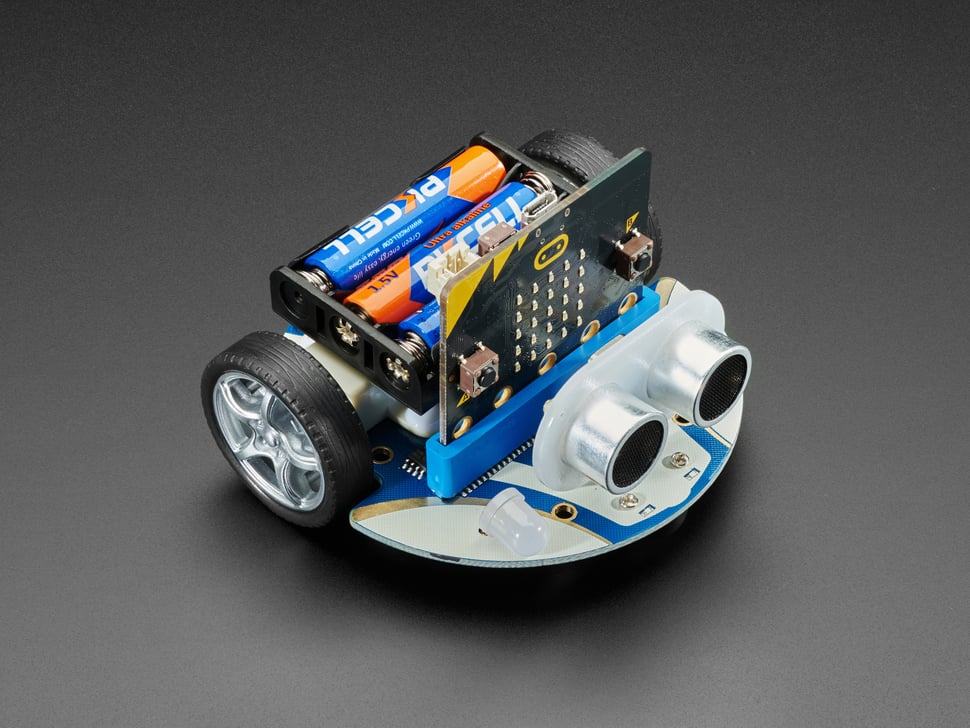

# ELECFREAKS CuteBot for Micro:Bit
ELECFREAKS manufactures the [CuteBot](https://www.elecfreaks.com/micro-bit-smart-cutebot.html) car for the Micro:Bit. This little device is capable of many incredible things: line sensing, ultra sonic sensing, I2C addons, and much more. EREC put together a little summer course for our students that used these devices, introducing the logistics behind electric cars, an area of industry that is growing at a rapid pace.

In our attempt to create lessons and code for our students, we discovered that another individual had already forged a path forward with this device in Mu-Editor: [Krakenus](https://github.com/Krakenus/microbit-cutebot-micropython). Using his examples to teach ourselves, we began assembling lessons and making code to achieve the goals our students desired

  

---
## :blue_car: CuteBot Car Modules
The codebase for our CuteBot consists of three scripts:
* main.py
* cutebotcar.py
* radioRECIEVER.py

### main.py
This is the `main loop`, where the most baisc logic happens in our code. 

### cutebotcar.py
This is our cutebotcar library, chock full of function defintions that can allow the car to execute almost any task, such as:
* Moving forward or backward
* Turning left or right
* Detecting light
* Turning the headlights on
* Changing the headlight color
* Sensing lines using IR
* Sensing using ultra sonic sensors via the I2C bus
* I2C commands to other peripherals

### radioRECIEVER.py
This is our receiver that listens for commands from our transmitting Micro:Bit.

---
## :computer: Controlling the CuteBot Car (via a laptop)
There are three additonal pieces of code that control our CuteBot and live in two different places:

### Micro:Bit Transmitter
To control our CuteBot, we need another Micro:Bit plugged into our laptop. Upload the `radioTRANSMITTER.py` code to it (found in `RemoteControl(Laptop)`, reset it, and it will await your commands from the laptop.

### Laptop Controller
With our codebase, our laptop is our remote control. Download the `RemoteControl(Laptop)` directory to your computer, then run `serialInterface.py` to send arrow keys to your transmitter, that then get sent to your car, which makes it move!
