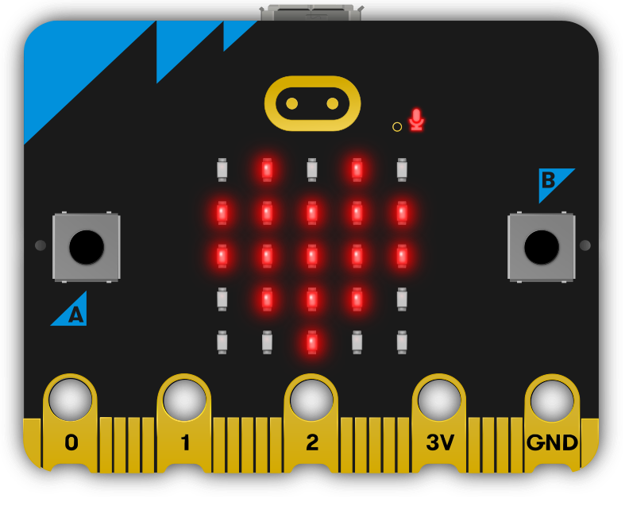

# The Micro:Bit
The Micro:Bit continues to prove itself as a wonderful tool for kids in the world of STEM, including the ability to teach embedded programming with an easy to understand language: microPython. Unfortunaltey, there seems to be few (if any) good explainations on how to teach the embedded microPython environment with the physical hardware of the Micro:Bit and all of the addons that can be used with it. This repository is built as a response to the lack of technical code for these applications.

  

## 🐍 Notes on our Development Environments 🐍
Our volunteers and students utilize Ubuntu 20.04, Ubuntu 22.04, and occasionally Windows 10 operating systems for code development/testing. Most of our work is done in the linux environment, but a few of our students bring thier own laptops that have Windows. The code that our kids develop is in Mu-Editor; if you need installation information on Mu-Editor, please consult their [website](https://codewith.mu/). Thonny also works wonders and is a viable application if you like; if you need installation information on Thonny, please consult their [website](https://thonny.org/).
